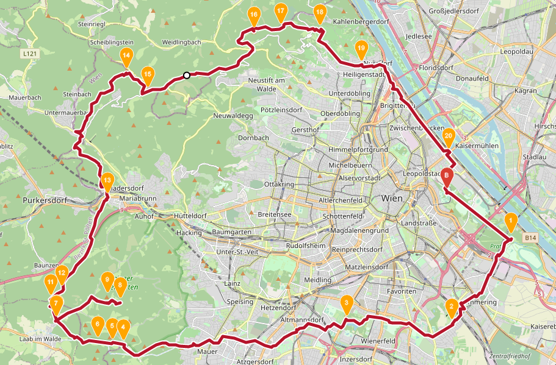

# Vienna Grätzl Project

1.	[Innere Stadt](./1/Info.md/)
2.	[Leopoldstadt](./2/Info.md/)
3.	[Landstraße](./3/Info.md/)
4.	[Wieden](./4/Info.md/)
5.	[Margareten](./5/Info.md/)
6.	[Mariahilf](./6/Info.md/)
7.	[Neubau](./7/Info.md/)
8.	[Josefstadt](./8/Info.md/)
9.	[Alsergrund](./9/Info.md/)
10.	[Favoriten](./10/Info.md/)
11.	[Simmering](./11/Info.md/)
12.	[Meidling](./12/Info.md/)
13.	[Hietzing](./13/Info.md/)
14.	[Penzing](./14/Info.md/)
15.	[Rudolfsheim-Fünfhaus](./15/Info.md/)
16.	[Ottakring](./16/Info.md/)
17.	[Hernals](./17/Info.md/)
18.	[Währing](./18/Info.md/)
19.	[Döbling](./19/Info.md/)
20.	[Brigittenau](./20/Info.md/)
21.	[Floridsdorf](./21/Info.md/)
22.	[Donaustadt](./22/Info.md/)
23.	[Liesing](./23/Info.md/)

# Summits of Vienna
 
[Route](https://maps.openrouteservice.org/directions?n1=48.178163&n2=16.374092&n3=14&a=48.210397,16.403157,48.19324,16.439332,48.161008,16.405966,48.162421,16.34697,48.153318,16.221313,48.153719,16.215219,48.154348,16.20698,48.162078,16.183548,48.168948,16.21964,48.171037,16.212258,48.162393,16.183805,48.170221,16.180372,48.173599,16.186638,48.208345,16.21243,48.255223,16.222944,48.248283,16.235132,48.270626,16.294785,48.271883,16.310062,48.271597,16.332035,48.258113,16.355295,48.225244,16.404476,48.210232,16.403232&b=2&c=0&k1=en-US&k2=km)
https://maps.openrouteservice.org/directions?n1=48.178163&n2=16.374092&n3=14&a=48.210397,16.403157,48.19324,16.439332,48.161008,16.405966,48.162421,16.34697,48.153318,16.221313,48.153719,16.215219,48.154348,16.20698,48.162078,16.183548,48.168948,16.21964,48.171037,16.212258,48.162393,16.183805,48.170221,16.180372,48.173599,16.186638,48.208345,16.21243,48.255223,16.222944,48.248283,16.235132,48.270626,16.294785,48.271883,16.310062,48.271597,16.332035,48.258113,16.355295,48.225244,16.404476,48.210232,16.403232&b=2&c=0&k1=en-US&k2=km