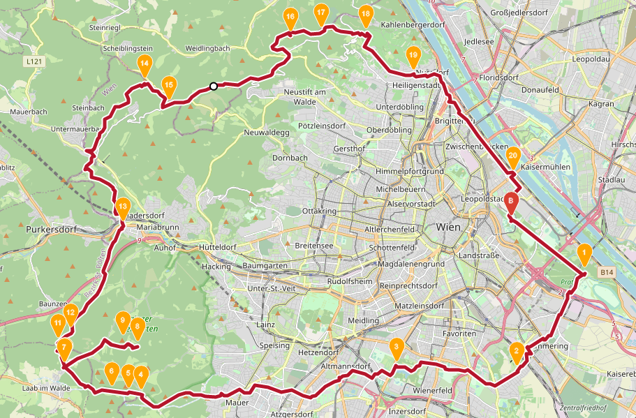

# Summits of Vienna
Biketour auf die "höchsten Berge Wiens"

## About
* <a href="https://de.wikipedia.org/wiki/Liste_der_Berge_Wiens" target="_blank">Liste der Berge Wiens</a>
* <a href="https://maps.openrouteservice.org/directions?n1=48.178163&n2=16.374092&n3=14&a=48.210397,16.403157,48.19324,16.439332,48.161008,16.405966,48.162421,16.34697,48.153318,16.221313,48.153719,16.215219,48.154348,16.20698,48.162078,16.183548,48.168948,16.21964,48.171037,16.212258,48.162393,16.183805,48.170221,16.180372,48.173599,16.186638,48.208345,16.21243,48.255223,16.222944,48.248283,16.235132,48.270626,16.294785,48.271883,16.310062,48.271597,16.332035,48.258113,16.355295,48.225244,16.404476,48.210232,16.403232&b=2&c=0&k1=en-US&k2=km" target="_blank">Link zur Route</a>

## Route

### Gewählte Berge:

| Berg               | Höhe (Wiener Null) |
|--------------------|--------------------|
| Konstantinhügel    | 13 m               |
| Laaer Berg         | 99 m               |
| Wienerberg         | 88 m               |
| Hornauskogel       | 343 m              |
| Kaltbründlberg     | 351 m              |
| Dreihufeisenberg   | 358 m              |
| Unbenannte Anhöhe   | 361 m              |
| Schutzengelberg    | 351 m              |
| Rosskopf           | 350 m              |
| Hermannskogel      | 385 m              |
| Vogelsangberg      | 359 m              |

[^1]: im Lainzer Tiergarten an der Stadtgrenze zu Purkersdorf

## Live Pics

